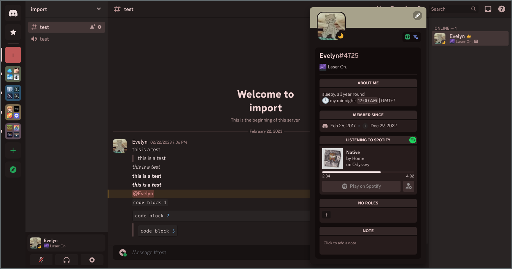
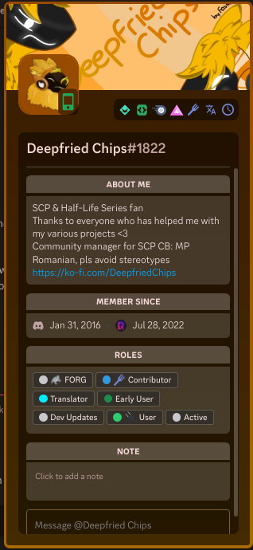
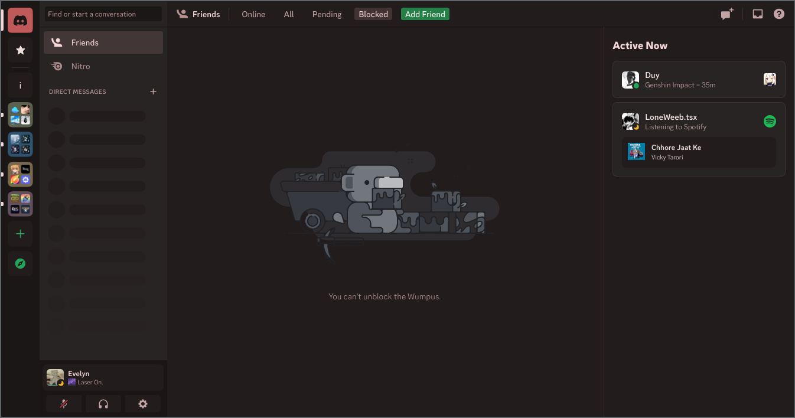

<h1 align="center">Matter</h1>
<h4 align="center">The {insert your feelings here} theme ever for Replugged</h4>

## Preview

Hue scheme used in the screenshots: `--matter-brand-hue: 0`

### Server UI & User popout

### Nitro User popout

### DM Menu

## Customization

There is almost literally no customizations except for the hue of the color scheme (define your own hue for the color scheme by overriding
`--matter-brand-hue`)

## Installation

The release's version is likely to be outdated. Build the theme yourself.

> **Warning** This theme is a **work in progress**. The current look of the theme is subject to change. Things might also look really bad (ex. white
> text on a bright background).
